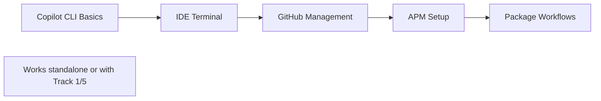

# Track 6: Copilot CLI and Agent Package Manager

Master command-line AI workflows and package reusable AI context for team sharing.

**Duration:** 2-3 hours

---

## Cross-Track Enhancements

💡 **Enhanced with Track 1:** Package domain instructions and custom agents with APM  
🔗 **Complements Track 5:** Package MCP-powered workflows for distribution

---

## Prerequisites

**Required:**
- GitHub CLI (`gh`) installed
- GitHub Copilot CLI extension (`gh copilot` command working)
- Git installed

**Recommended (Optional):**
- Track 1 completed (APM can package domain instructions/agents)
- Track 5 completed (APM can package MCP workflows)

---

## Workshop Flow



---

## Quick-Start (15 minutes)

Get started with CLI and APM:

1. **Test Copilot CLI** (3 min)
   - Run `copilot` in terminal → Try: *"List my open pull requests"*
2. **Use IDE Terminal** (5 min)
   - VS Code terminal → Ctrl+I → Ask: *"Explain this git command: git rebase -i HEAD~3"*
3. **Try APM** (7 min)
   - Install APM → Run `apm init my-package` → Explore structure

**Ready for advanced workflows?** Continue with the full exercises below.

---

## Part 1: Copilot in the Terminal

### IDE Terminal Integration

**VS Code / Visual Studio / JetBrains:**

**Use Inline Chat in Terminal:**
1. Open terminal in your IDE
2. Press **Ctrl+I** (Windows/Linux) or **Cmd+I** (Mac)
3. Ask questions about commands

**Example Prompts:**
- *"How do I find all files larger than 100MB in this directory?"*
- *"Explain this command: docker compose up --build"*
- *"Generate a git command to undo the last 3 commits without losing changes"*
- *"Create a bash script to backup this directory daily"*

**Use Cases:**
- Command explanation and suggestions
- Shell script generation
- Git workflow help
- Complex command construction

---

## Part 2: Copilot CLI

### Installation

Install the standalone Copilot CLI ([documentation](https://docs.github.com/en/copilot/how-tos/set-up/install-copilot-cli)):

```bash
# Install via npm (recommended)
npm install -g @githubnext/github-copilot-cli

# Or via GitHub CLI extension
gh extension install github/gh-copilot
```

**Verify installation:**
```bash
copilot --version
```

### Interactive Mode

**Start interactive session:**
```bash
copilot
```

**Try these prompts:**
- `List my open pull requests`
- `What are the git branches in this project?`
- `Show recent commits in this repository`
- `Explain the difference between git merge and git rebase`

**Exit:** Type `exit` or press Ctrl+C

### Programmatic Mode

**Pass prompts directly:**
```bash
copilot -p "List my open PRs"
copilot -p "Show me the last 5 changes made to the README.md file"
copilot -p "What files changed in the last commit?"
```

### Automatic Tool Approval

**For non-destructive commands, auto-approve tool usage:**
```bash
copilot -p "List all files in this directory" --allow-tool 'shell'
copilot -p "Show git status" --allow-tool 'shell'
```

**⚠️ Warning:** Only use `--allow-tool` with safe, read-only operations

---

## Exercise 1: GitHub Repository Management

**Purpose:** Manage GitHub repos and issues from the command line.

### Steps

**1. Interactive session:**
```bash
copilot
```

**2. Issue Management:**
```
Create an issue for improving the documentation in this repository
List all open issues assigned to me in this repository
Check the changes made in the most recent pull request
```

**3. File Management:**
```
Create a new file called CONTRIBUTING.md with basic contribution guidelines
Create a pull request to add the new CONTRIBUTING.md file
```

**4. GitHub Actions:**
```
List any Actions workflows in this repo
Create a simple GitHub Actions workflow that runs tests on pull requests
```

---

## Exercise 2: Project Development Workflows

**Purpose:** Use CLI for local development tasks.

### Steps

**1. Code Quality:**
```
Analyze the code quality in this project and suggest improvements
Create a .gitignore file appropriate for this project type
Generate a package.json file for a Node.js project with common dependencies
```

**2. Code Review:**
```
Review the last commit and explain what changes were made
Find any TODO comments in the codebase and list them
Suggest improvements to the project structure
```

**3. Git Workflows:**
```bash
# Programmatic mode
copilot -p "Show me commits from the last week"
copilot -p "Create a git command to create a new branch from main"
copilot -p "Explain the merge conflicts in the current branch"
```

---

## Exercise 3: Model Selection and Advanced Features

**Purpose:** Explore different AI models and advanced CLI features.

### Model Selection

**In interactive mode:**
```
/model
```

**Available models (varies by subscription):**
- GPT-4 Turbo
- Claude Sonnet
- o1-preview (for complex reasoning)
- o1-mini (faster reasoning)

**Compare models:**
```
# Try the same prompt with different models
/model gpt-4-turbo
Explain dependency injection in TypeScript

/model claude-sonnet
Explain dependency injection in TypeScript
```

**Observe:** Different models may provide different perspectives

### Slash Commands

**In interactive mode, try:**
- `/mcp` - See available MCP servers (if Track 5 completed)
- `/model` - Switch AI models
- `/help` - View available commands
- `/clear` - Clear conversation history

---

## Part 3: Agent Package Manager (APM)

### What is APM?

**APM** (Agent Package Manager) is the "npm for AI agents" - package and share AI workflows, instructions, and context.

**Key Features:**
- 📦 Package custom instructions, agents, and prompts
- 🔄 Share across teams and projects
- 📚 Compose AI context from dependencies
- 🚀 Version and distribute AI workflows

[APM Documentation](https://github.com/danielmeppiel/apm)

---

## Exercise 4: Setup APM

**Purpose:** Install and configure APM for packaging AI workflows.

### Installation

**1. Create project directory:**
```bash
mkdir apm-exercise && cd apm-exercise
```

**2. Set GitHub token:**
```bash
# Get token from: https://github.com/settings/personal-access-tokens/new
# Required scopes: read:user, read:org, repo (if accessing private repos)

# Windows PowerShell
$env:GITHUB_COPILOT_PAT="your_fine_grained_token_here"

# Mac/Linux
export GITHUB_COPILOT_PAT=your_fine_grained_token_here
```

**3. Install APM CLI:**
```bash
curl -sSL "https://raw.githubusercontent.com/danielmeppiel/apm/main/install.sh" | sh

# Or on Windows with PowerShell:
iwr -useb "https://raw.githubusercontent.com/danielmeppiel/apm/main/install.ps1" | iex
```

**4. Setup runtime:**
```bash
# Set up GitHub Copilot CLI with native MCP support
apm runtime setup copilot
```

**Verify:**
```bash
apm --version
```

---

## Exercise 5: Create Your First AI Package

**Purpose:** Package a reusable AI workflow.

### Initialize Package

**1. Create new package:**
```bash
apm init my-ai-package && cd my-ai-package
```

**2. Install dependencies:**
```bash
apm install
```

### Explore Package Structure

**Generated files:**
- `apm.yml` - Package manifest (like `package.json`)
- `.prompt.md` files - Agent workflows
- `.instructions.md` files - Context and rules
- `apm_modules/` - Installed dependencies

**Example `apm.yml`:**
```yaml
name: my-ai-package
version: 0.1.0
description: My custom AI workflows
author: YourName

dependencies:
  danielmeppiel/base-guidelines: latest

prompts:
  - start.prompt.md
  - review.prompt.md

instructions:
  - coding-standards.instructions.md
```

---

## Exercise 6: Create Custom Workflows

**Purpose:** Package development workflows for team use.

### Create a Code Review Workflow

**Create `code-review.prompt.md`:**

```markdown
---
mode: 'agent'
description: 'Comprehensive code review workflow'
---
Perform a code review of the specified file or directory.

Ask user:
1. What file/directory to review?
2. Focus area: security, performance, maintainability, or all?

Review process:
1. Analyze code structure and organization
2. Check for security vulnerabilities
3. Identify performance issues
4. Evaluate code quality and maintainability
5. Suggest specific improvements with line numbers

Provide summary with:
- Critical issues (must fix)
- Improvements (should consider)
- Best practices (nice to have)
```

### Create Coding Standards Instructions

**Create `standards.instructions.md`:**

```markdown
# Coding Standards

## TypeScript
- Use strict type checking
- Prefer interfaces over type aliases for object shapes
- Use async/await over promises
- Document complex functions with JSDoc

## React
- Use functional components with hooks
- Extract custom hooks for reusable logic
- Use TypeScript for prop types
- Keep components under 300 lines

## Testing
- Unit tests for business logic
- Integration tests for API endpoints
- Use meaningful test names (should/when/then)
- Aim for 80%+ coverage

## Git
- Conventional commits format
- Keep commits atomic and focused
- Meaningful PR descriptions
- Reference issues in commits
```

### Package Domain Instructions (With Track 1)

**If you completed Track 1, package your domain instructions:**

```bash
# Copy domain instructions to APM package
cp -r .github/instructions/* ./instructions/
cp -r .github/prompts/* ./prompts/
cp -r .github/agents/* ./agents/
```

**Update `apm.yml`:**
```yaml
name: my-project-standards
version: 1.0.0

instructions:
  - instructions/common.instructions.md
  - instructions/backend.instructions.md
  - instructions/frontend.instructions.md

prompts:
  - prompts/feature-start.prompt.md
  - prompts/code-review.prompt.md

agents:
  - agents/backend-specialist.agent.md
  - agents/frontend-specialist.agent.md
```

---

## Exercise 7: Install and Use Community Packages

**Purpose:** Leverage existing APM packages.

### Install Community Packages

```bash
# Install compliance rules
apm install danielmeppiel/compliance-rules

# Install design guidelines
apm install danielmeppiel/design-guidelines

# List dependencies
apm deps list
```

### Compose Packages

**Create a specialized package that extends community packages:**

**`apm.yml`:**
```yaml
name: enterprise-standards
version: 1.0.0

dependencies:
  danielmeppiel/compliance-rules: latest
  danielmeppiel/security-guidelines: latest
  my-org/coding-standards: ^1.2.0

instructions:
  - enterprise-specific.instructions.md
```

---

## Exercise 8: Package and Share

**Purpose:** Distribute your AI packages to your team.

### Compile for Compatibility

**Generate AGENTS.md for non-APM tools:**
```bash
apm compile
```

This creates an `AGENTS.md` file compatible with other AI tools.

### Run Packaged Workflows

```bash
# Run workflows with parameters
apm run start --param name="<YourGitHubHandle>"

# Run specific prompt
apm run code-review --param file="src/index.ts"
```

### Publish to Git

**1. Create GitHub repository:**
```bash
gh repo create my-ai-package --public
```

**2. Push package:**
```bash
git add .
git commit -m "Initial APM package"
git push origin main
```

**3. Tag version:**
```bash
git tag v1.0.0
git push --tags
```

**4. Share with team:**
```bash
# Team members can now install
apm install your-org/my-ai-package
```

---

## APM Use Cases

### 1. Team Coding Standards

Package your team's coding standards, linting rules, and best practices for consistent AI assistance.

### 2. Domain-Specific Workflows (Track 1)

Package domain specialists, instructions, and workflows from Track 1 for team distribution.

### 3. MCP-Powered Workflows (Track 5)

Package prompt files that use MCP tools for database analysis, API testing, etc.

### 4. Onboarding New Developers

Create an onboarding package with:
- Project architecture instructions
- Development workflows
- Code review checklists
- Common tasks as prompt files

### 5. Multi-Project Consistency

Share a base package across multiple projects to maintain consistency.

**Example organization:**
```
my-org/base-package (shared across all projects)
  ├── dependencies: danielmeppiel/compliance-rules
  ├── instructions: coding-standards.md
  └── prompts: code-review.prompt.md

my-org/frontend-package (frontend projects)
  ├── dependencies: my-org/base-package
  ├── instructions: react-standards.md
  └── agents: frontend-specialist.agent.md

my-org/backend-package (backend projects)
  ├── dependencies: my-org/base-package
  ├── instructions: api-standards.md
  └── agents: backend-specialist.agent.md
```

---

## Discussion Questions

**Reflect on these questions:**

1. **Sharing AI Context:** How does APM compare to your current approach for sharing AI context within your team?

2. **Packageable Workflows:** What development workflows or coding standards in your organization could benefit from being packaged as APM modules?

3. **Consistency:** How could APM help maintain consistency across different projects in your organization?

4. **Dependencies:** What are the advantages of treating AI context and workflows as packageable dependencies?

5. **Integration:** If you completed Track 1 and Track 5, how could you combine domain instructions, MCP tools, and APM packaging for a complete solution?

---

## Learn More

**APM Resources:**
- [APM Documentation](https://github.com/danielmeppiel/apm/blob/main/docs/README.md)
- [Getting Started Guide](https://github.com/danielmeppiel/apm/blob/main/docs/getting-started.md)
- [Core Concepts](https://github.com/danielmeppiel/apm/blob/main/docs/concepts.md)

**AI-Native Development:**
- [Agent CLI Runtimes](https://danielmeppiel.github.io/awesome-ai-native/docs/tooling/#agent-cli-runtimes)
- [AI-Native Development Guide](https://danielmeppiel.github.io/awesome-ai-native)

**Copilot CLI:**
- [Install Copilot CLI](https://docs.github.com/en/copilot/how-tos/set-up/install-copilot-cli)
- [Copilot CLI Usage](https://docs.github.com/en/copilot/using-github-copilot/using-github-copilot-in-the-command-line)

---

## Platform Notes

### VS Code / Visual Studio

Full support for terminal integration (Ctrl+I in terminal) and Copilot CLI.

### JetBrains IDEs

Terminal integration available - use Copilot inline chat in terminal. APM works across all platforms.

### Cross-Platform

APM works on Windows, Mac, and Linux. CLI tools work consistently across platforms.

---

## Key Takeaways

✅ **Terminal Integration:** Use Copilot directly in IDE terminal for command help  
✅ **CLI Power:** Manage repos, issues, and development workflows from command line  
✅ **Package & Share:** APM makes AI context reusable and distributable  
✅ **Team Consistency:** Package domain standards for consistent AI assistance  
✅ **Compose Context:** Build on community packages for rapid setup

---

## Navigation

[← Previous: MCP Integration](TRACK5_MCP_INTEGRATION.md) (Optional) | [🏠 Home](README.md)
